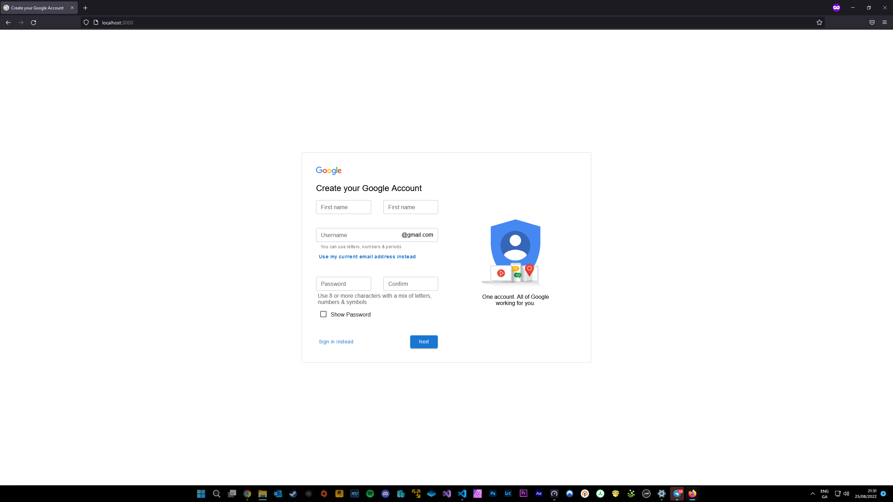

<h3 align="center">Google-Signup-Page</h3>

Google Sign Up Page written in JS with react.

### Screenshots

  

#### Warning
This is not to be used in a commercial enviroment, it was rewritten to show how simple it is to make the google signup page.

#### How to use
There are a few dependencies that need to be installed before it can be run, open a new terminal and copy/paste the next few lines in!
- "npm install @mui/material @emotion/react @emotion/styled"
- "npm install @mui/material @mui/styled-engine-sc styled-components"

- then you can type into the terminal "npm run start" to start the webserver

#### Contributing
If you have any idea how to make this app better, please [create a pull request](https://github.com/JaredWestley/VirusTotalChecker/compare). If you find any bug, please [create an issue](https://github.com/JaredWestley/VirusTotalChecker/issues/new).

#### License
This project is licensed under GPLv3 and it's libraries under their license. Please check both [LICENSE.txt](LICENSE.txt) and [LICENSE_3rd.txt](LICENSE_3rd.txt).
